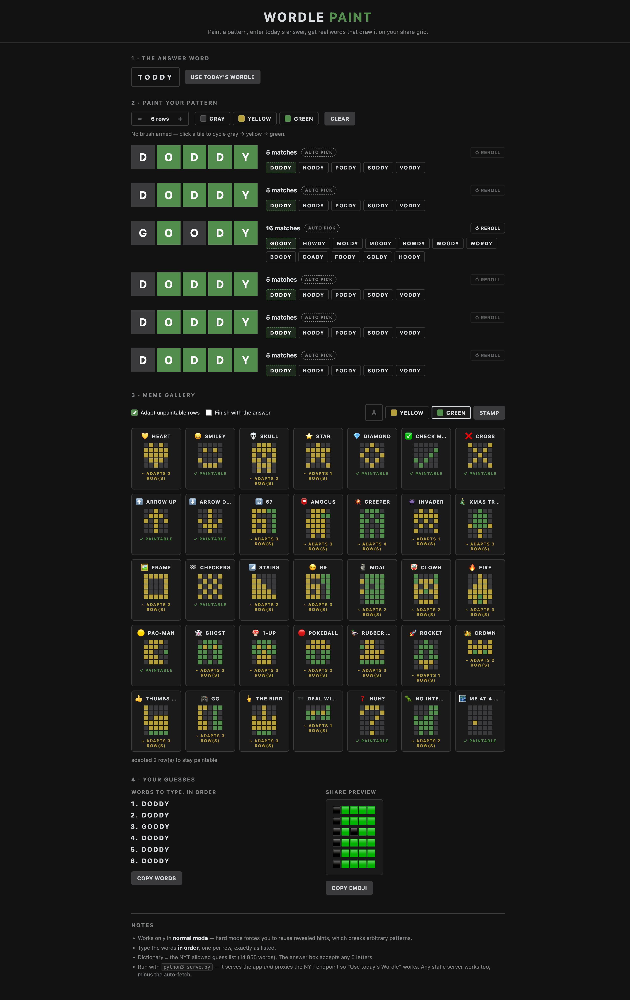

# Wordle Paint 🎨

Draw pixel art on your real Wordle share grid. You paint the colors you want,
enter the day's solution word, and the tool finds real allowed guess words that
produce exactly those colors — type them in order and your share grid becomes art.



Inspired by [KMChris/paint-on-wordle](https://github.com/KMChris/paint-on-wordle),
rebuilt as a zero-dependency web app.

## Run it

```bash
cd wordle-paint
python3 serve.py
# open http://localhost:8000
```

`serve.py` serves the app and proxies the NYT daily-word endpoint same-origin,
so the *Use today's Wordle* button fills the answer automatically. Any static
server (`python3 -m http.server`, GitHub Pages, …) also works — ES modules
just won't load from `file://` — but then the button falls back to an
open-the-link-and-paste flow, because NYT blocks cross-origin browser fetches.

## How to use

1. **Enter the answer word.** Click *Use today's Wordle* — with `serve.py` it
   fills in automatically. On a plain static server the app shows you a link to
   `https://www.nytimes.com/svc/wordle/v2/<date>.json` instead; open it and
   paste the `"solution"` value. (Yes, this spoils today's puzzle. That's the
   point.)
2. **Paint your pattern.** Click tiles to cycle gray → yellow → green, or arm a
   brush swatch and drag to paint. Use the row stepper for shorter art.
   Or skip straight to the **meme gallery**: 35 one-click stencils — heart,
   "67", "69", moai 🗿, clown, fire, Pac-Man (plus his ghost), 1-UP mushroom,
   pokeball, rubber duck, rocket, crown, thumbs up, GG, the Bird, Deal-With-It
   sunglasses, chrome dino, "Me at 4 AM" (one lit window, the classic
   "Not Wordle" anti-joke), amogus, creeper, and more — plus a stamp that
   draws any letter, digit, `!` or `?` in a 3×5 pixel font. Each card shows a
   live badge for the current answer — "✓ paintable" or "~ adapts N rows" —
   because not every pattern exists for every answer; with *adapt unpaintable
   rows* on, impossible rows snap to the nearest paintable pattern
   (yellow↔green swaps preferred over adding/removing paint, so the shape
   survives). *Finish with the answer* appends the winning all-green row.
3. **Pick your words.** Each row shows how many dictionary words produce that
   exact pattern, with candidate chips (familiar words first). Click a chip to
   choose, or keep the auto pick. Reroll for different samples.
4. **Play.** Copy the word list and type the words into Wordle in order.

The app warns you when a row's pattern is impossible (no word in the NYT allowed
guess list produces it — e.g. four greens plus a yellow can never happen) and
when an all-green row isn't last (guessing the answer ends the game).

Works in **normal mode only** — hard mode forces you to reuse revealed hints,
which breaks arbitrary patterns.

## How it works

`solver.mjs` implements the NYT tile-coloring rules (two-pass duplicate-letter
handling: greens consume letters first, then yellows left to right) and brute
forces the 14,855-word allowed guess list per row. Patterns are 5-char strings
over `0` gray / `1` yellow / `2` green.

```js
import { feedbackFor, findMatches } from './solver.mjs';
feedbackFor('eeeee', 'geese');            // '02202'
findMatches('02020', 'toddy', GUESSES);   // 64 words
```

## Files

| File | What it is |
|---|---|
| `index.html`, `style.css`, `app.js` | the web app (no frameworks, no build) |
| `solver.mjs` | pattern-matching engine, pure ES module (feedback, matches, achievable-pattern sweep, nearest-paintable search) |
| `presets.js` | meme stencils + 3×5 pixel font for the stamp |
| `words.js` | generated word lists — allowed guesses from [tabatkins/wordle-list](https://github.com/tabatkins/wordle-list), classic answers (used for ranking) from cfreshman's list |
| `test/` | `node --test` suite (41 tests: duplicate-letter edge cases, achievability, presets/font) |
| `.verify/` | independent oracle + differential test (471k comparisons) used to validate the solver; rerun with `node .verify/diff.mjs` |
